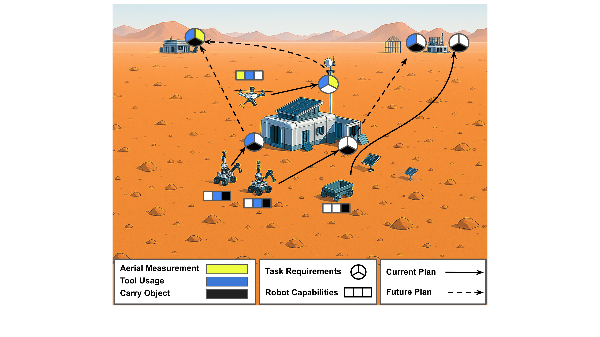
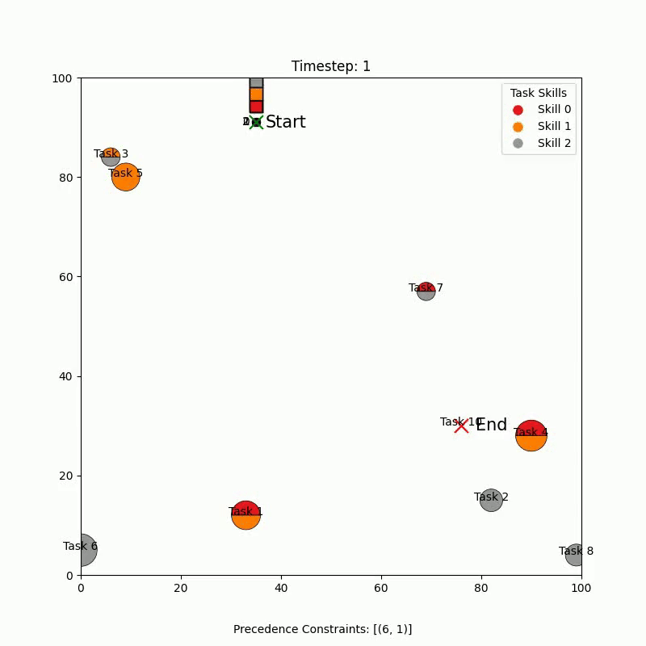
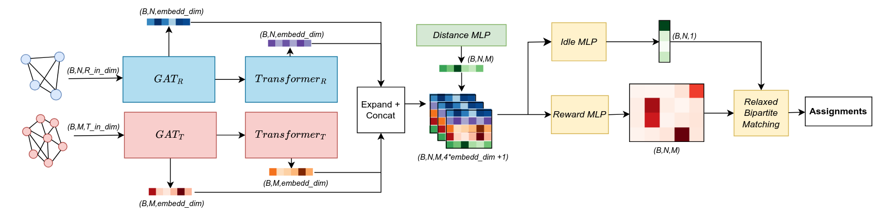

# SADCHER: Scheduling using Attention-based Dynamic Coalitions of Heterogeneous Robots in Real-Time

<p align="center">
  
</p>

This repository accompanies our paper submission to IEEE MRS 2025, called "SADCHER: Scheduling using Attention-based Dynamic Coalitions of Heterogeneous Robots in Real-Time". The project was developed as part of my Master's thesis at Delft University of Technology under the supervision of Prof. Javier Alonso-Mora and Andreu Matoses Gimenez. The [paper](media/Sadcher_IEEE_MRS25.pdf), the [thesis report](media/Bichler_Thesis_Report.pdf) and the [literature review](media/Bichler_Literature_Review.pdf) can  be found in this repo. The released dataset can be downloaded [here](https://data.4tu.nl/datasets/10e28ee0-9ad9-450d-8be7-6e6a91f2931f).

We present Sadcher, a real-time task assign- ment framework for heterogeneous multi-robot teams that incorporates dynamic coalition formation and task precedence constraints. Sadcher is trained through Imitation Learning and combines graph attention and transformers to predict assignment rewards between robots and tasks. Based on the predicted rewards, a relaxed bipartite matching step generates high-quality schedules with feasibility guarantees. We explicitly model robot and task positions, task durations, and robots’ remaining processing times, enabling advanced temporal and spatial reasoning and generalization to environments with different spatiotemporal distributions compared to training. Trained on optimally solved small-scale instances, our method can scale to larger task sets and team sizes. Sadcher outper- forms other learning-based and heuristic baselines on random- ized, unseen problems for small and medium-sized teams with computation times suitable for real-time operation. We also explore sampling-based variants and evaluate scalability across robot and task counts. In addition, we release our dataset of 250,000 optimal schedules to facilitate future research.

The repository also contains code to benchmark the performance of our method against other methods in the literature, including [HeteroMRTA](https://github.com/marmotlab/HeteroMRTA),  a greedy method and the exact MILP solver.

We also provide code for the experiments with Reinforcement Learning fine-tuning.


## Simple Demo
<p align="center">
  
</p>

## Network Architecture
<p align="center">
  
</p>


## 🔧 Installation

This project uses [`uv`](https://github.com/astral-sh/uv) to manage dependencies and run scripts.  
All requirements are defined in `pyproject.toml`

### 📦 Recommended: Install `uv` - [uv Docs](https://docs.astral.sh/uv/getting-started/installation/)
```bash
curl -LsSf https://astral.sh/uv/install.sh | sh
```

After installing uv, any of the scripts can be ran with 

```bash
uv run script_you_want_to_run.py
```
## 📁 Repository Overview

- **`baselines/`**  
  Contains MILP and greedy solvers for comparison with learning-based methods.

- **`benchmarking/`**  
  Tools to benchmark different schedulers and generate performance statistics and scaling graphs.

- **`data_generation/`**  
  Scripts to generate randomized MRTA problem instances and optimal solution datasets.

- **`helper_functions/`**  
  Core utility classes for tasks, robots, and schedule handling.

- **`imitation_learning/`**  
  Training code, datasets, and pretrained checkpoints for the imitation learning pipeline.

- **`models/`**  
  Neural network components including GATs, Transformers, and the full scheduler architecture.

- **`reinforcement_learning/`**  
  PPO-based reinforcement learning environments and training scripts using [skrl](https://skrl.readthedocs.io/en/latest/) for fine-tuning the scheduler.

- **`schedulers/`**  
  All implemented schedulers including Sadcher (IL), SadcherRL (RL), greedy, and bipartite matchers.

- **`simulation_environment/`**  
  2D simulation engine, configuration, and visualizations of scheduling results.

- **`visualizations/`**  
  Scripts for visualizing benchmark results, scaling behavior, and specific problem instances.

- **`pyproject.toml`**  
  Project metadata and dependencies — all installed automatically when using `uv run`.

