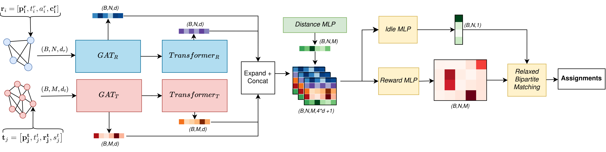

# SADCHER: Scheduling using Attention-based Dynamic Coalitions of Heterogeneous Robots in Real-Time

<p align="center">
  
</p>

This repository accompanies our paper submission to IEEE MRS 2025, called "SADCHER: Scheduling using Attention-based Dynamic Coalitions of Heterogeneous Robots in Real-Time". The project was developed as part of my Master's thesis at Delft University of Technology under the supervision of Prof. Javier Alonso-Mora and Andreu Matoses Gimenez.  Links to the paper and the thesis will be added once they are available.

We propose a novel learning-based framework for real-time multi-robot task allocation (MRTA) with heterogeneous agents/robots, dynamically formed coalitions and precedence constraints. Our approach combines graph attention networks and transformer-based encoders, and bipartite matching to generate high-quality task assignments. It is trained via imitation learning on optimally generated schedules. 


The repository also contains code to benchmark the performance of our method against other methods in the literature, including [HeteroMRTA](https://github.com/marmotlab/HeteroMRTA),  a greedy method and the exact MILP solver.

We also provide code for the experiments with Reinforcement Learning fine-tuning, which is not part of the paper submission. 


## Simple Demo
<p align="center">
  
</p>

## Network Architecture
<p align="center">
  
</p>


## 🔧 Installation

This project uses [`uv`](https://github.com/astral-sh/uv) to manage dependencies and run scripts.  
All requirements are defined in `pyproject.toml`

### 📦 Recommended: Install `uv` - [uv Docs](https://docs.astral.sh/uv/getting-started/installation/)
```bash
curl -LsSf https://astral.sh/uv/install.sh | sh
```

After installing uv, any of the scripts can be ran with 

```bash
uv run script_you_want_to_run.py
```
## 📁 Repository Overview

- **`baselines/`**  
  Contains MILP and greedy solvers for comparison with learning-based methods.

- **`benchmarking/`**  
  Tools to benchmark different schedulers and generate performance statistics and scaling graphs.

- **`data_generation/`**  
  Scripts to generate randomized MRTA problem instances and optimal solution datasets.

- **`helper_functions/`**  
  Core utility classes for tasks, robots, and schedule handling.

- **`imitation_learning/`**  
  Training code, datasets, and pretrained checkpoints for the imitation learning pipeline.

- **`models/`**  
  Neural network components including GATs, Transformers, and the full scheduler architecture.

- **`reinforcement_learning/`**  
  PPO-based reinforcement learning environments and training scripts using [skrl](https://skrl.readthedocs.io/en/latest/) for fine-tuning the scheduler.

- **`schedulers/`**  
  All implemented schedulers including Sadcher (IL), SadcherRL (RL), greedy, and bipartite matchers.

- **`simulation_environment/`**  
  2D simulation engine, configuration, and visualizations of scheduling results.

- **`visualizations/`**  
  Scripts for visualizing benchmark results, scaling behavior, and specific problem instances.

- **`pyproject.toml`**  
  Project metadata and dependencies — all installed automatically when using `uv run`.

